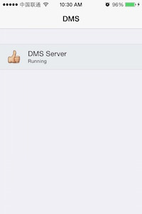
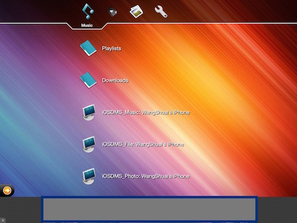
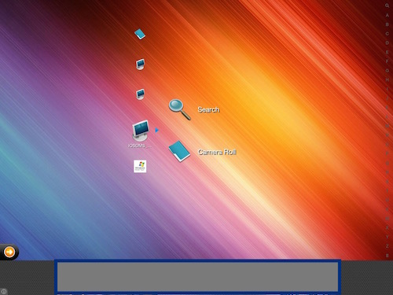
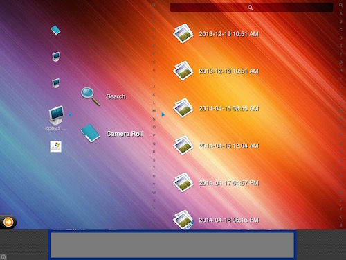
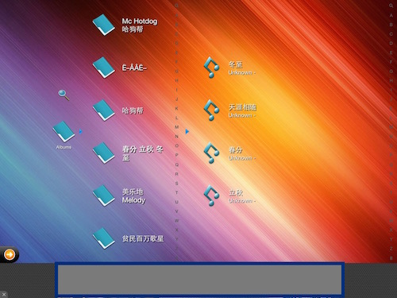

# DLNA_iOS_Platinum
使用 Platinum 实现的一个 DLNA 的媒体服务器，可以将手机内的 iTunes 和相册资源发送给 DLNA Player 播放。

##项目说明:
DLNA_iOS 是基于之前为 iOS5 开发的一个 DMS 服务端应用修改而来。之前的项目并没有持续更新维护，而且 *Platinum* 被封装在了公司内部使用的 *Framework* 中，并且大量使用了公司内部封装的静态工具库，在没有安装它们的前提下，项目很难 build 成功；后来为了便于其它同志开发 DMS 应用做参考，利用空闲时间将其整理，其中：

1. 采用 *PlatinumKit-1-0-5-13_0ab854* 版本；
2. 直接通过 Framework 的方式引用 *Platinum* ,方便快捷；
3. 采用 *Delegate* 方式，实现和扩展 DMS 功能更加方便；

之前 APP 中的很多功能，比如 APP 内部 Document 目录的管理和 WiFi 传输的功能没有实现，之后可以根据时间的充裕与否来补充以上两部分功能。

----
##功能介绍
DLNA_iOS 是采用 *Platinum* 实现的一个 DMS 服务端应用。它可以将您手机中的媒体文件*(照片、音乐、视频)*文件，分享给 DLNA播放器,功能包括:

 1. 将 APP 中 *Document* 目录下所包含的媒体文件分享给DLNA播放器；
 2. 将手机 *iTunes* 应用中的音乐和视频文件分享给DLNA播放器；
 3. 将手机 *照片* 应用中的照片和拍摄的视频短片分享给DLNA播放器;
 
####提供服务
DLNA_iOS 会同时开启3个服务，分别对应以上提及的三种媒体文件来源；您可以在 DLNA播放器中搜索到这3个服务，并浏览相应的媒体文件。

####APP端
手机APP端的功能相对单一，只是显示当前 APP 所开启的 DMS 服务器的状态，之后会加入通过Web方式向手机端APP上传媒体文件的功能等。

----

